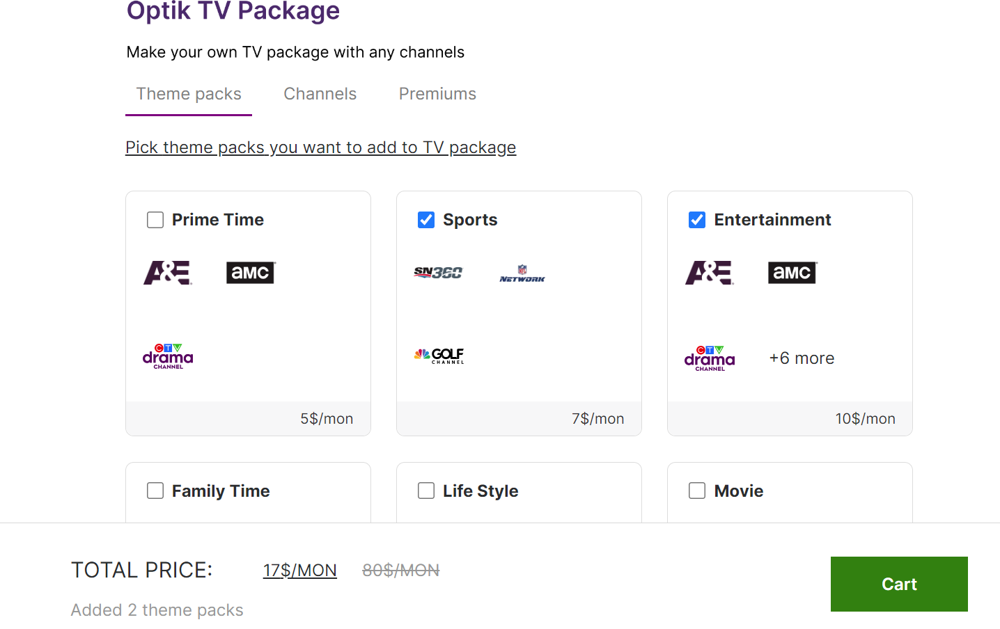
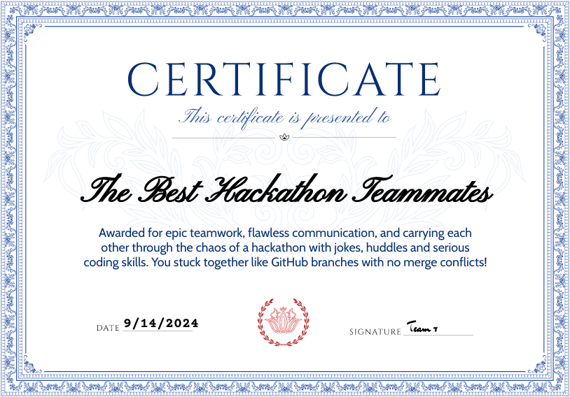

 Build-Your-Own+

## 📖 Table of Contents

- [Introduction](#star-introduction)
- [Team Profile](#handshake-team-profile)
- [Problem Space](#thinking-problem-space)
- [Research Highlights](#telescope-research-highlights)
- [Technology Stack](#mag-technology-stack)
- [Our Innovative Solution](#bulb-our-innovative-solution)
- [Solution Demonstration](#iphone-solution-demonstration)
- [Installation Instructions](#computer-installation-instructions)
- [Key Learnings](#seedling-key-learnings)
- [References](#books-references)
- [Accolades](#trophy-accolades)

## :star: Introduction

Welcome to Telus Build-Your-Own+, an innovative project developed by our six-member team during a dynamic 24-hour hackathon in partnership with Telus. Our solution addresses the growing challenge of streaming service option paralysis by empowering users to curate a personalized TV package featuring all their preferred channels. By streamlining the process, we aim to give consumers more control over their media consumption, offering a seamless, user-friendly experience tailored to their entertainment preferences.

## :handshake: Team Profile

**Team Name:** StreamWeavers

**Members:**

- **[Yuanshu Cai](https://www.linkedin.com/in/yuanshucai/)** - Developer
- **[Kristina Tripak](https://www.linkedin.com/in/kristina-tripak/)** - UX Designer/Developer
- **[Stephen Mustapha](https://www.linkedin.com/in/stephen-mustapha-ng/)** - Developer
- **[Sameer Singh](https://www.linkedin.com/in/sameersingh22/)** - Developer
- **[Zanab Shah](https://www.linkedin.com/in/zanab-jafry-shah/)** - Developer/Data Scientist
- **[Sophia Chan](https://www.linkedin.com/in/sophia-g-chan/)** - Developer/Data Scientist

## :thinking: Problem Space

- **Overwhelming variety of streaming services**: Consumers face an increasing number of streaming platforms and content options, making it hard to decide where and how to access their favorite media.

- **Option paralysis**: Too many choices can lead to decision fatigue, causing frustration for users who struggle to manage multiple subscriptions and platforms.

- **Fragmentation in the streaming ecosystem**: As streaming providers compete for exclusive content, consumers are left juggling between various services to access the shows they love.

- **Lack of user-friendly solutions**: Current offerings do not provide an easy way for users to combine all their preferred channels or content into a single, streamlined package.

- **Consumer demand for personalization**: Users want more control over their media experience, preferring to curate a personalized TV package that suits their individual viewing preferences.

- **Industry challenge**: Service providers are exploring how to package their offerings to better suit user needs, but there is a gap in creating a seamless and efficient approach to media consumption.

## :telescope: Research Highlights

- **Option Paralysis**: Research from Nielsen and Accenture shows that **46% of streaming users** struggle with content overload, leading to decision fatigue. Many consumers indicated they would prefer an aggregator that simplifies choices and allows for better content discovery[^1][^2].

- **Consumer Trends**: Current trends show that users increasingly demand **personalized experiences**. According to a survey by Epsilon, **80% of consumers** are more likely to engage with a platform that offers personalized recommendations and bundles based on their preferences[^3].

[^1]: [Nielsen Report](https://www.nielsen.com/insights/2022/whats-old-is-new-again-bundles-could-help-consumers-cope-with-increasing-streaming-service-choice/)
[^2]: [Accenture Study](https://newsroom.accenture.com/news/2022/sixty-percent-of-global-consumers-are-frustrate[…]on-streaming-video-services-according-to-accenture-report)
[^3]: [Epsilon Report](https://www.epsilon.com/us/about-us/pressroom/new-epsilon-research-indicates-80-of-c[…]to-make-a-purchase-when-brands-offer-personalized-experiences)

## :mag: Technology Stack

Our project leverages modern web development technologies to deliver a seamless and dynamic user experience. The following tools and technologies were used:

- **JavaScript**:
- **React**
- **JSON (JavaScript Object Notation)**

## :bulb: Our Innovative Solution

Present your solution in detail, highlighting how it addresses the problem space. List the key benefits, features, and innovations introduced.

## :iphone: Solution Demonstration

Provide links to a demo, prototype, or screenshots. Visuals help demonstrate how the solution works in action.

### Try It Out

- [Live Demo](YOUR_LIVE_DEMO_LINK)

## :computer: Installation Instructions

Steps for users to install and run the project locally:

1. Clone this repository.
2. Navigate to the project directory and install dependencies with `npm install`.
3. Start the development server using `npm start`.

## :seedling: Key Learnings

- **Communication is Key:** Clear and consistent communication kept everyone on the same page, preventing last-minute surprises and ensuring a smooth workflow.
- **Git Pull Before Merge:** Always pull the latest changes before merging to avoid conflicts and keep the codebase clean—lesson learned the hard way!
- **Stay Calm, We’re Solving the Same Problem:** Even when challenges arose, staying calm and remembering that we're all working toward the same goal helped us navigate tough situations.
- **Teamwork & Responsibility:** Taking ownership, stepping up when needed, and supporting each other made a huge difference in overcoming obstacles and getting things done as a team.

## :books: References

- https://www.nielsen.com/insights/2022/whats-old-is-new-again-bundles-could-help-consumers-cope-with-increasing-streaming-service-choice/

## :trophy: Accolades

